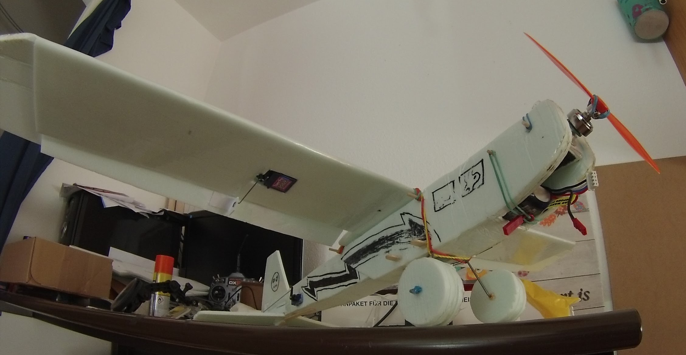

# RC-Journey

## Types of Aircraft

1. Planes
   1. Glider (with or without motor) 
   2. High wing (trainer / stol)  
   3. Mid wing (3d) 
   4. Low wing (warbirds)
   5. Wing 
1. Helicopters
   1. Scale  
   2. 3D 
1. Drones
   1. Camera (typical DJI) 
   2. Cinematic (mix off freestyle and camera)
   3. Freestyle / Racing 
  
## How to get started

**Do not start with a cool fighter jet - you will destroy it!!!**

1. Get something simple to fly
    1. Tiny indoor drone (with prop protection) 
    2. Stabaliesed camera drone (with prop protection)
    3. A Trainer airplane (with recovery function or dihedral)
2. Get a simulator and use it for some time

## Is this something you can image to get into?

You probably tried now lots of different things in the sim and had lots of fun with huge helicopers or extreme jets or maybe even with a 1/3 scale piper cub. **Don't by anything like that yet!!!**

### Find a local club

Good your town name and combine it with rc/model airplane and the changes are pretty good that you find something.
Types of clubs
1. Just for fun - small crappy airfield and you can fly what you want - no matter how old or cheap it was.
2. Normal Clubs - medium airflied - wide variaty of mentality
3. Bigger Clubs - prefessional airflied, clubhouse, youth group - sometimes expect that everyone has to fly a 3000$ or more model to call it rc-flying, 

If the club in your town feels not right for you, have a look at a club in the surrounding. There will be one that meet your style.

What all clubs have in common that is that you need to have a insurance (~50$ a year in germany)

### Lisence? / Legal?

Learn about the rules from your club. Or checkout the [Kenntnisnachweis](https://kenntnisnachweisonline.dmfv.aero/) from the dmfv

